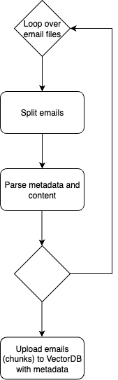

# Portfolio Healt Report Blueprint

## Overview

### Step 1: Data Ingestion
The emails are all related to one project. First step is to parse emails, extract the metadata (from, to, cc, subject, date), and the content of the email. The emails are uploaded to a vector database, including the metadata so filtering can be done in l steps.

### Step 2: Thread Analysis
The AI powered analytical sub-system analyzes the emails thread-by-thread. This is be done by using the filtering provided by the metadata. The LLM receives the content of the whole thread, ordered by date, and analyzes the content and pinpoints risks, inconsistencies, and unresolved issues. The LLM will also receive additional context from other threads, if relevant, to provide a more comprehensive analysis. These outputs are stored for the next step.

### Step 3: Summarizing the Analysis
In this last step, the LLM receives the outputs from the previous step and generates a summary of the analysis. This summary will include the identified risks, inconsistencies, and unresolved issues.

## Data Ingestion
The system parses the emails using regular expressions to extract the metadata and content. The emails are then uploaded to a vector database, which allows for efficient filtering and retrieval based on the metadata.

This approach can handle large-scale data, since the vector database is designed for high performance and scalability. The metadata extraction ensures that the system can filter emails based on various criteria, such as sender, recipient, date, and subject. This also allows the system to filter emails not just by the thread, but also by the semantic content of the emails, which can be used to get rid of irrelevant emails in later steps (i.e. emails about a birthday party), which drastically reduces the amount of data that needs to be processed by LLMs in the next steps.

## The Analytical Engine
